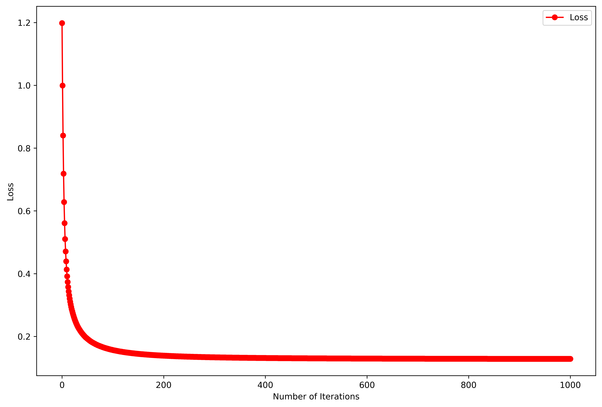

# Logistic Regression

Lei Mao

University of Chicago

## Introduction

This is an implementation of logistic regressor from scratch in Python. It used vectorized gradient descent to optimize the parameters of the model, and also employed some tricks to prevent the numeric overflow and underflow problems that are normal to logistic regression.


## Dependencies

Python 3.5

Numpy 1.14

Pandas 0.22 (for demo purpose)

Scikit-Learn 0.19.1 (for demo purpose)


## Files

```
.
├── data
│   ├── wdbc.data
│   └── wdbc.names
├── LICENSE.md
├── logistic_regressor.py
├── loss.png
├── main.py
├── README.md
└── utils.py
```


## Usage

In Python, to build logistic regressor using the package in a Scikit-Learn style:

```python
from logistic_regressor import LogisticRegressor

model = LogisticRegressor(alpha = 0.05, c = 0.01, T = 1000, random_seed = 0, intercept = True)
model.fit(X = X_train, y = y_train)

training_predictioins = model.predict(X = X_train)
test_predictions = model.predict(X = X_test)
```


## Demo

To build logistic regressor on [Breast Cancer Wisconsin (Diagnostic)](https://archive.ics.uci.edu/ml/datasets/Breast+Cancer+Wisconsin+(Diagnostic)) dataset, and test its training and test performance:

```bash
$ python main
Training Error Rate: 0.017582
Test Error Rate: 0.000000
```

The training loss goes down against gradient descent iterations as expected:

<p align="center">
    
</p>

The training error rate is 0.018 and the test rate error is 0, which is extremely good for this dataset.